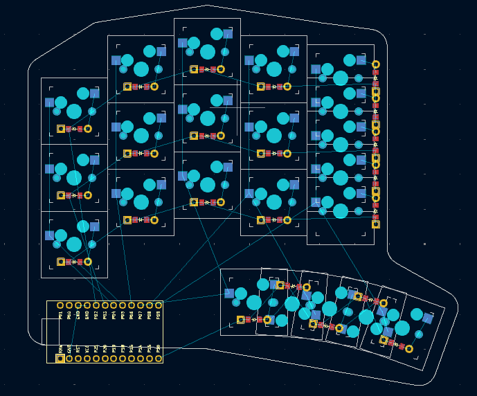
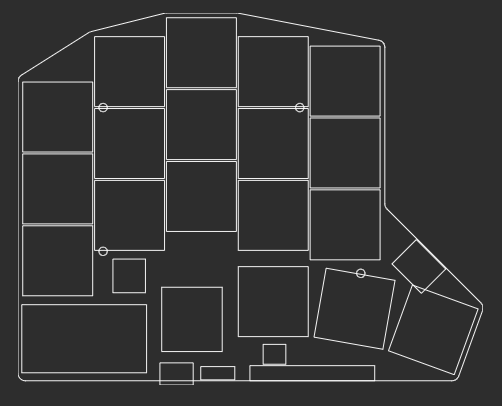
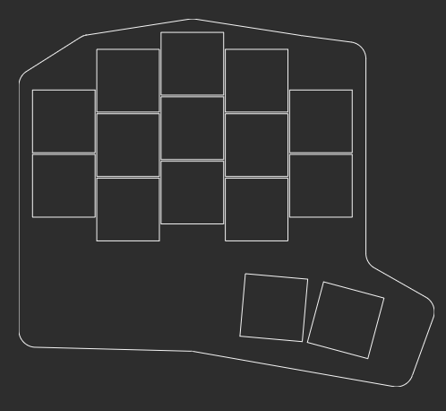

# menura

## Design goals

- A single PCB design that allows you to seamlessly switch between and try out many layouts, gradually reducing your keycount from a 3x5\_3 layout like on the [sweep36](https://github.com/sadekbaroudi/sweep36), to 3x5\_2 like the [sweep](https://github.com/davidphilipbarr/Sweep), then finally a 23332\_2 like the [hummingbird](https://github.com/PJE66/hummingbird).
- A key feature is that the hotswap sockets are positioned such that you can solder *all* of them, making it so you do not have to commit to one layout or the other at build-time. On one built board, you should be able to select which sockets receive a switch at assembly-time, allowing for more flexibility in layout experimentation.
- An additional consideration is the relocation of the MCU out of the "center" of the board (taking into account both halves as a whole). By keeping the edge cut as close to the inner column as possible, our goal is to allow for a case design with various size wedges in the center such that you can experiment with aggressive unibody angles like the [barobord](https://github.com/sadekbaroudi/barobord), or more relaxed angles like the [duet](https://github.com/zzeneg/duet).
- Leaning into the concept of flexibility and versatility, a tertiary design goal is [vik](https://github.com/sadekbaroudi/vik) support.
- Concessions made:
    - To support the overlapping key positions, MX spacing was used. With choc spacing, I don't think you can vertically offset them by half a switch without the center hole colliding with the hotswap socket.
    - To support vik, the design would need to use a pro-micro form factor MCU. RIP xiao :(

## Inspiration and references

- Ergogen configs
    - [nostrum](https://github.com/bennytrouser/nostrum)
    - [trochilidae](https://github.com/jcmkk3/trochilidae/tree/main)
    - [corax](https://github.com/dnlbauer/corax-keyboard/tree/main)
    - [flatfootfox's guide](https://flatfootfox.com/ergogen-introduction/)
- Other boards:
    - [vulpes minora](https://github.com/sadekbaroudi/vulpes-minora)
    - [urchin](https://github.com/duckyb/urchin)
    - [temper](https://github.com/raeedcho/temper)
    - [klotz](https://github.com/GEIGEIGEIST/KLOTZ)
- Modular wedge design planned to use similar technique as in [this reddit post](https://redd.it/1ej0ngl)

## Naming

Bird names rule.  
Given that the primary goal of this keyboard is to be able to *mimic* many other keyboards, I went with the [lyrebird](https://en.wikipedia.org/wiki/Lyrebird) (scientific name, menura), due to:

> They are most notable for their impressive ability to mimic natural and artificial sounds from their environment

and

> It is one of the world's largest songbirds, and is renowned for its elaborate tail and courtship displays, and its excellent mimicry. The species is endemic to Australia and is found in forest in the southeast of the country. According to David Attenborough, the superb lyrebird displays one of the most sophisticated voice skills within the animal kingdom—"the most elaborate, the most complex, and the most beautiful"

## Images

Menura PCB: 

Menura in 36 key configuration: 

Menura in 30 key configuration: 

## TODOs

- routing
- slide-on wedge case and center wedge
- magnet case and wedge
- "tenting leg" hole case and wedge
