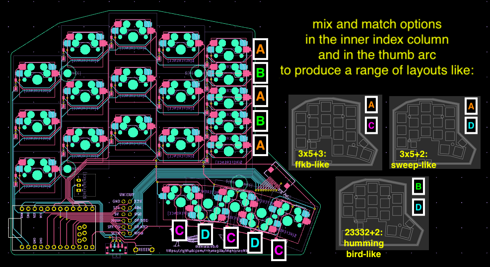
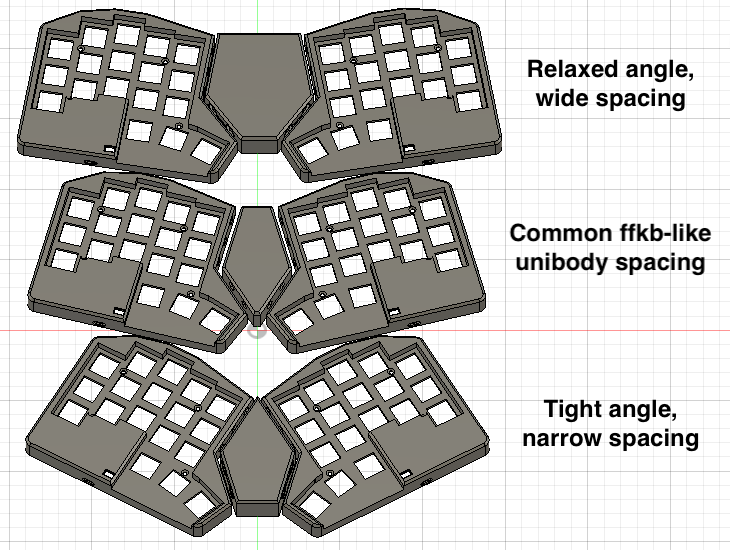

# menura

<!-- very first thing should be like a paneled (2x2 or 2x3 grid of keyboard pics showing different layouts) -->

The menura is a 30 to 36 key wireless split MX keyboard compatible with the [VIK standard](https://github.com/sadekbaroudi/vik) for modular peripheral device support.

The core concept is a single PCB design which supports *mimicry* of many physical layouts, allowing for non-committal experimentation.
This is accomplished by utilization of overlapping (but not mutually exclusive) switch footprints, and a PCB shape which permits effective conversion to the unibody form factor.

The menura is named for the [lyrebird](https://en.wikipedia.org/wiki/Lyrebird) (scientific name, *menura*), due to its skill in mimicry:

> They are most notable for their impressive ability to mimic natural and artificial sounds from their environment  
> [...]  
> It is one of the world's largest songbirds, and is renowned for its elaborate tail and courtship displays, and its excellent mimicry.

# Design goals

The primary design goal was to create a PCB that would allow you to seamlessly switch between and try out many layouts, gradually reducing your keycount from a 3x5+3 layout like on the [sweep36](https://github.com/sadekbaroudi/sweep36), to 3x5+2 like the [sweep](https://github.com/davidphilipbarr/Sweep), then eventually a 23332+2 like the [hummingbird](https://github.com/PJE66/hummingbird).  
In parallel to the keycount flexibility, I also wanted it to be easy to try out both a true split layout as well as unibody layouts ranging from the aggressively angled like the [barobord](https://github.com/sadekbaroudi/barobord) to more relaxed angles like the [duet](https://github.com/zzeneg/duet).

To accomplish this goal, the menura has two key features:

## Partially overlapping switch footprints

By carefully arranging switch footprints, we can set it up such that *all* hotswap sockets can be soldered without interfering with each other.  
This allows you to defer the choice of layout to case assembly time rather than being forced to commit irreversibly at PCB build time, encouraging experimentation.

This requires a concession to use MX switches only.
Reduced choc spacing and the shape of choc hotswap sockets make simultaneous installation of all switch sockets impossible (at least without compromising on switch rotation, which impacts keycap compatibility, etc).

## MCU relocation and unibody wedges

To allow for effective and flexible unibody conversion, the MCUs needed to be relocated out of their conventional spot next to the inner index column.
Without this modification, we cannot get the halves close enough together to accurately mimic unibody layouts.

The resulting PCB edge cut enables a case + wedge design that can reproduce a wide range of unibody angles and inter-half distances.  
The case designs in this repo support insertion of magnets into the case walls to allow for simple insertion and removal of the wedges.

## VIK support

Finally, after accomplishing the two previous goals, to lean into the theme of flexibility, versatility and experimentation, we added support for the [VIK standard](https://github.com/sadekbaroudi/vik) for peripheral device support.
This means that with one flat flexible cable (FFC), you can integrate a wide range of add ons, like a nice!view display or a cirque trackpad.

# Building your own menura

To build your own menura:

1. Order PCBs from somewhere like [JLC](https://jlcpcb.com/) using the gerbers in the [releases](https://github.com/rmuraglia/menura-kb/releases) section of this repo
2. Follow the [build guide](/docs/build-guide.md) to:
    1. Solder the PCB
    2. Assemble the case, using a case printed from the [`case/`](/case/) directory
3. Write and flash your own ZMK firmware, using the [menura shield module](https://github.com/rmuraglia/zmk-keyboards-menura). The ZMK docs has a page on [modules](https://zmk.dev/docs/features/modules), if you don't know how to use the module

If you want to quickly inspect the PCB or schematic to debug something or further understand the design, you can quickly view these in browser with kicanvas: [menura in kicanvas](https://kicanvas.org/?github=https://github.com/rmuraglia/menura-kb/blob/main/pcb/menura.kicad_pro).  
Tip: in the pcb view, within the sidebar's objects section (with the triangle, circle and square icon), you can turn the slider for "zones" all the way down to stop displaying the ground fill to better see the traces and footprints. 

# Inspiration and references

The board's concept, with flexible key positions and the ability to use two split halves as one whole was inspired heavily by [ErgoTravelXT](https://github.com/FIXMBR/ErgoTravelXT).  
The layouts the menura attempts to mimic include the [ffkb](https://fingerpunch.xyz/product-tag/ffkb/), the [vulpes minora](https://github.com/sadekbaroudi/vulpes-minora), the [sweep](https://github.com/davidphilipbarr/Sweep) and [urchin](https://github.com/duckyb/urchin), the [hummingbird](https://github.com/PJE66/hummingbird), and countless others.

On the design side, I learned a ton on the ergogen side from the [nostrum](https://github.com/bennytrouser/nostrum), [trochilidae](https://github.com/jcmkk3/trochilidae) (rufous and berylline), and [corax](https://github.com/dnlbauer/corax-keyboard) configs, as well as [flatfootfox's guide](https://flatfootfox.com/ergogen-introduction/).  
Other boards I studied on the kicad side include the vulpes minora, urchin, [temper](https://github.com/raeedcho/temper) and [klotz](https://github.com/GEIGEIGEIST/KLOTZ).

# Thanks

I'd like to thank the members of the [fingerpunch](https://discord.gg/ewS6xbCgPb) discord community, especially Hazel who (unwillingly) taught me everything I know, Saixos and bravekarma for teaching me how to do things right (even if I usually ignored their suggestions), and reeve, damselfly, Yingeling and PyntieHet for celebrating every small step along the way and encouraging me to finish the project.
