# Building the PCB

## BOM

| Part                                   | Quantity | Notes                                                                                                                                              |
| -------------------------------------- | -------- | -------------------------------------------------------------------------------------------------------------------------------------------------- |
| menura PCB                             | 2        | PCB is reversible. Fabrication files can be found in the [releases](https://github.com/rmuraglia/menura-kb/releases) section.                      |
| controller                             | 2        | [nice!nano](https://nicekeyboards.com/nice-nano) or [suitable alternative](https://github.com/joric/nrfmicro/wiki/Alternatives#supermini-nrf52840) |
| (optional) controller sockets and pins | 48       | e.g. [sockets](https://github.com/joric/nrfmicro/wiki/Sockets)                                                                                     |
| diode                                  | 44       | SOD-123 1N4148W [example](https://www.lcsc.com/product-detail/Switching-Diode_GOODWORK-1N4148W_C909967.html)                                       |
| hotswap socket                         | 44       | MX                                                                                                                                                 |
| reset button                           | 2        | through hole 2 pin 3x6mm, e.g. [MJTP1243](https://www.digikey.com/en/products/detail/apem-inc/MJTP1243/1798039)                                    |
| power switch                           | 2        | PCM12-like, e.g. [MSK12C02](https://www.lcsc.com/product-detail/Toggle-Switches_SHOU-HAN-MSK12C02_C431540.html)                                    |
| (optional) battery jack                | 2        | 2-pin JST PH e.g. [S2B-PH-K-S](https://www.digikey.com/en/products/detail/jst-sales-america-inc./S2B-PH-K-S/926626)                                |
| battery                                | 2        | [301230 lipo](https://github.com/joric/nrfmicro/wiki/Batteries#301230) recommended for ease of tucking under mcu                                   |
| (optional) FFC connector               | 2        | 12 pin, 0.5mm pitch [example](https://www.lcsc.com/product-detail/FFC-FPC-Connectors_SHENZHEN-ATOM-TECH-FPC05012-09200_C479750.html)               |

## Build order

This is the order (and location) in which I like to install the components:

1. **Diodes**: install these on the *bottom* of the PCB. The line on the diode should be closer to the pad enclosed by a silkscreen marking. If this is unclear, please check the [build tips](#build-tips) section below.
2. **Hotswap sockets**: install on the *bottom* of the PCB
3. **Power switch**: install on the *top* of the PCB. You may install it on the bottom if you prefer, but you will then have to adjust the case
4. **Controller**: install on the *top* of the PCB. It is strongly recommended to socket your controller with sufficiently tall sockets so you can put the battery between the controller and the PCB. Be sure to align the labeled pins -- this means that on the left, the MCU will have the components on top, and on the right, the components will be facing down. If you are not confident in determining the controller orientation, I suggest reviewing the [build tips](#build-tips).
5. **Reset button**: install on *top* of the PCB. You may install it on the bottom if you prefer, but you will then have to adjust the case
6. **Battery jack**: install on *top* of the PCB. Note that you will only use 2 of the 3 through holes at any given time. Align the positive (+, conventionally red) terminal of your battery with the *center* hole of the footprint. Check the [build tips](#build-tips) for more detailed info. You may install this on the bottom if you prefer, etc etc
7. **FFC connector**: this footprint is only available on one side, so you don't have much of a choice 😅 

Your completed menura PCBs should look something like this, with some minor caveats -- I skipped step (7), and on the left I installed some pin headers for testing vik with the through hole breakouts.

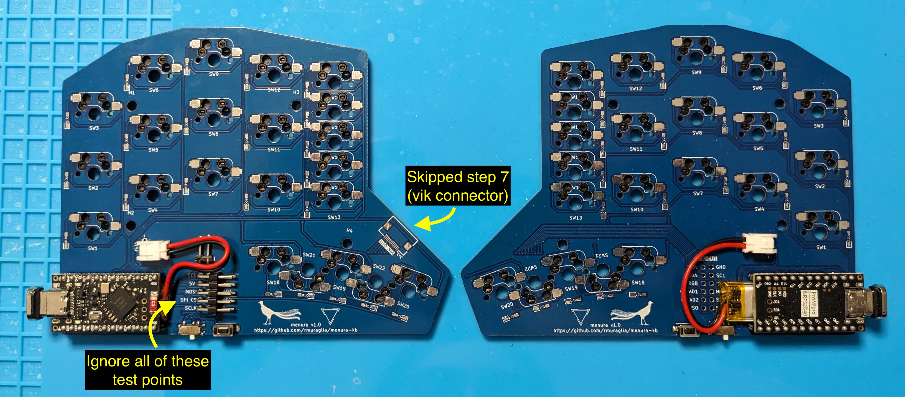
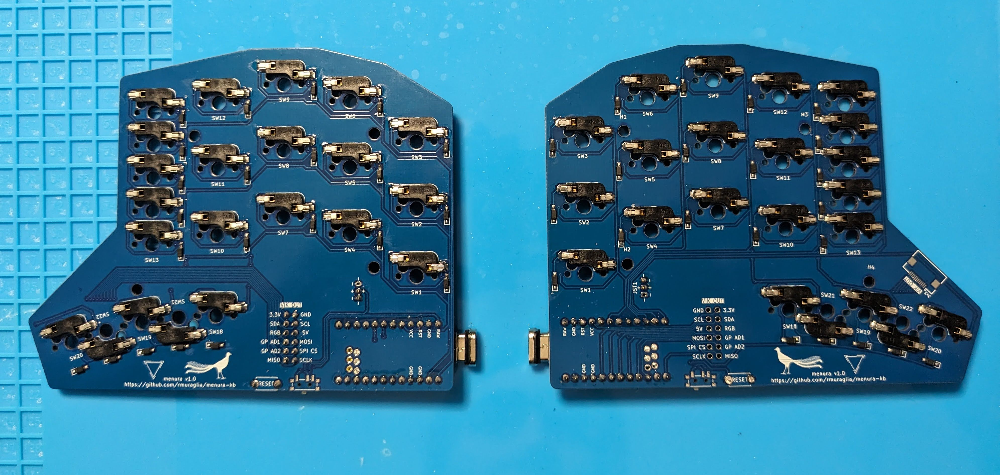

> [!NOTE]
> The power switch's ON position is when it is toggled closer to the side with only one pad.
> This means that if you follow the suggestion to install the power switches on the top of the PCB, then the ON positon will correspond to toggling the switch to the LEFT.  
> Yes, this is kind of counter-intuitive and regrettable.  
> No, I did not think of this when designing it.
> 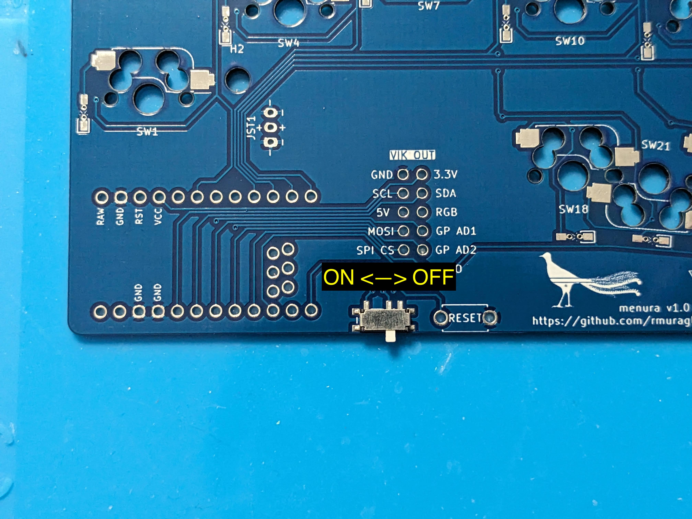

## Build tips

If you are new to building keyboards or soldering, this section contains some tips, additional details, and visuals that should help.
If anything from that abbreviated build order is unclear, expand the section below:

 Expand for general soldering tips

### Soldering SMD (surface mount) components

Via the [Kimiko build guide from keycapsss](https://keycapsss.com/help/kimiko/buildguide_en):

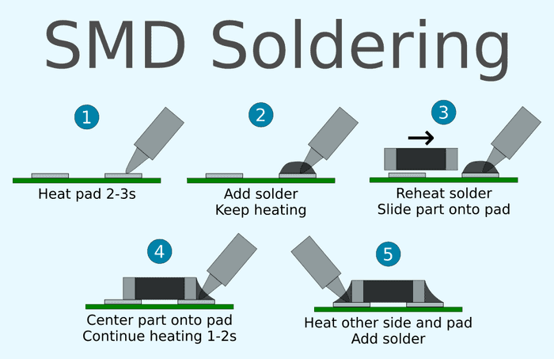

Basically:

1. tin one pad (heat and apply a little solder)
2. place the component while heating that pre-tinned side
3. once satisfied with placement and alignment, solder the other side

For self-guiding parts, like hotswap sockets which have plastic housings that fit into holes on the PCB, pre-tinning one side is not as critical -- you can just place the component and solder it in place.

### Soldering THT (through hole) components

Again, via the [Kimiko build guide from keycapsss](https://keycapsss.com/help/kimiko/buildguide_en):

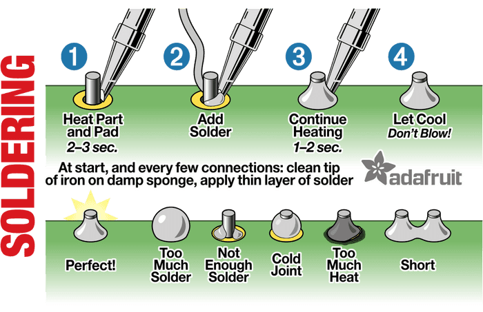

Basically:

1. place your component, and tape it in place if necessary
2. flip the board so you can access the pins poking through the plated holes
3. heat the pin **and** the hole
4. feed solder to the heated pin/hole, *not* directly to the iron -- this helps to make sure you adequately heated the part, to prevent a cold joint

### Socketing a controller

filterpaper's [guide to socketing microcontrollers](https://filterpaper.github.io/socket-mcu.html) is nice and to the point. In a nutshell:

1. Solder the sockets to the PCB
2. Cover the sockets with kapton tape
3. Insert pins by piercing through the tape
4. Solder the MCU (be **very** careful to verify the MCU orientation at this point). See the "MCU orientation" section in the next tip group if you are not sure how to determine this.
5. Remove the MCU, remove the tape, then re-place the MCU in the sockets

For step (1), a common challenge is making sure that the sockets are well aligned, vertically (i.e. pointing straight out of the hole, and not diagonally slanted).
While tape can help, it isn't always sufficient or reliable.  
I like to either use an extra set of sockets placed perpendicularly, or if you have one, an already-socketed MCU is great to force that vertical alignment:

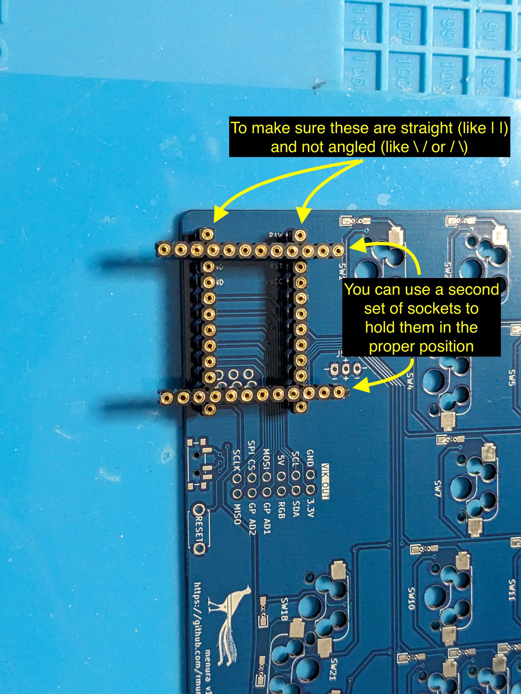

### Drag soldering fine pitch components

I've never actually done this yet! Maybe soon I will have tips based on first hand experience, but my general understanding is:

1. Apply a flux to the pins
2. Apply a blob of solder to the first pin
3. Drag the blob across the pins
4. Clean up any bridges

Expand for menura-specific build tips and info

### Parts overview

Before getting started, here is a quick visual overview of the parts you should have ready to go:

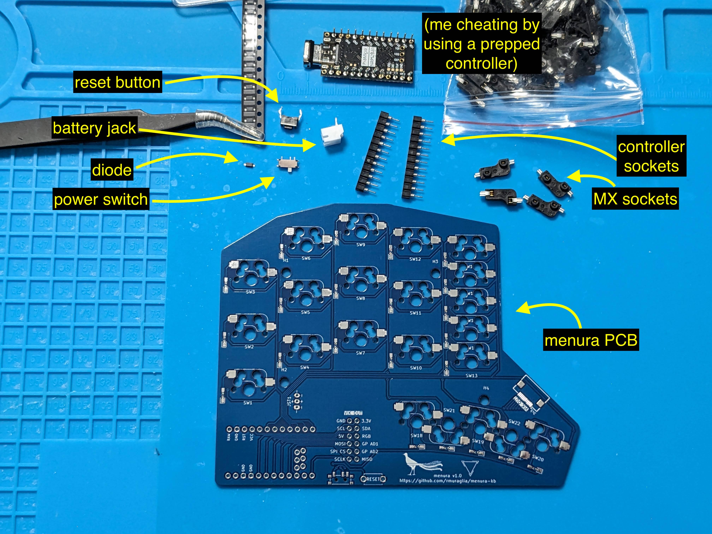

###  Diode orientation

The side of the diode with the line corresponds to the pad enclosed by a box on the silkscreen

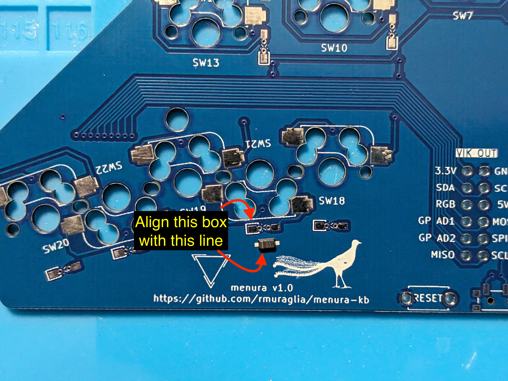

### Battery jack orientation

> [!WARNING]
> I assume that red on your battery corresponds to (+) based on common conventions, but this is not guaranteed.
> Before doing anything with your battery, you should [check the battery polarity with a multimeter](https://electronics.stackexchange.com/a/104377), and reverse the instructions below if necessary.

The 3-holed footprint for the 2-pin component is to provide flexiblity in battery jack orientation.
The red (+) wire of your battery will **always** go to the center hole, then you place the black (-) wire to whichever outer hole provides the most convenient orientation for you.  
For example, for my left and right sides, I orient the jack as follows:

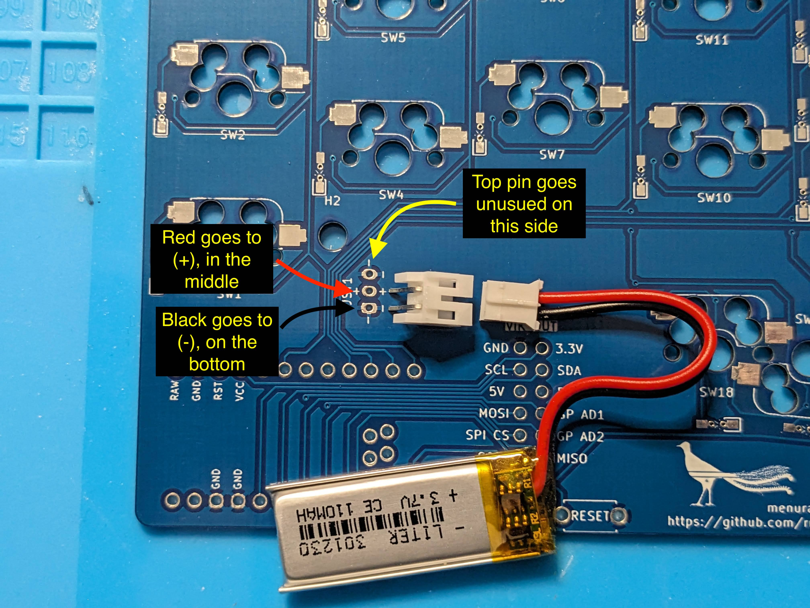
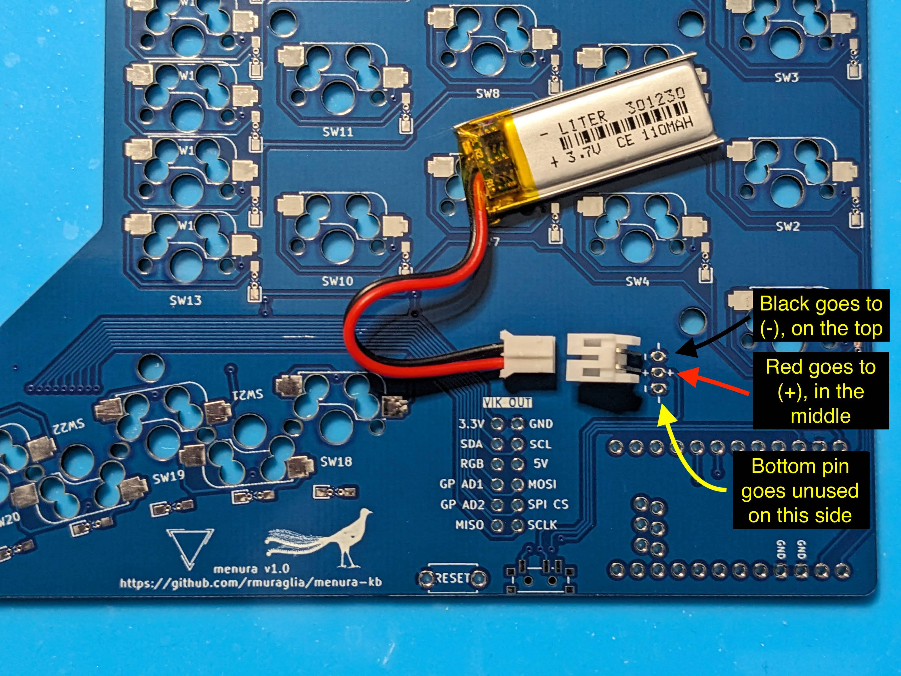

### MCU orientation

To verify the MCU orientation, use the labeled pins like GND, RST and VCC as reference points, and ensure that they will be aligned between the MCU and PCB.
Adhering to this simple constraint will guarantee that you install it correctly, rather than trying to remember or interpret "face up", "components down" or some other phrase.

I always like to use the consecutive ground pins as my reference point.
Cross reference with the [nice!nano pinout diagram](https://nicekeyboards.com/docs/nice-nano/pinout-schematic/) to make sure you're reading the pin labels on your MCU correctly:

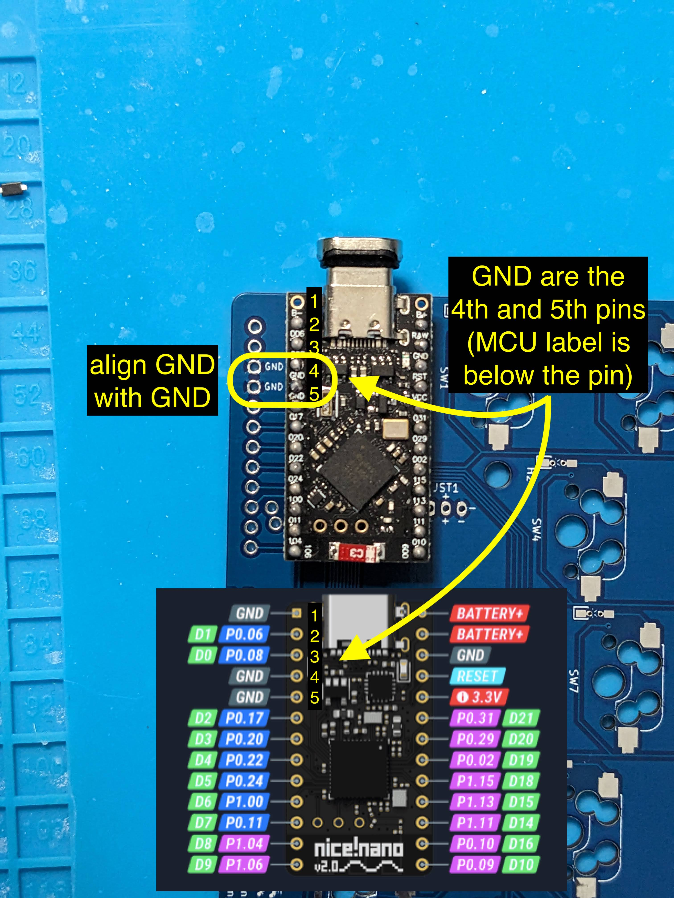
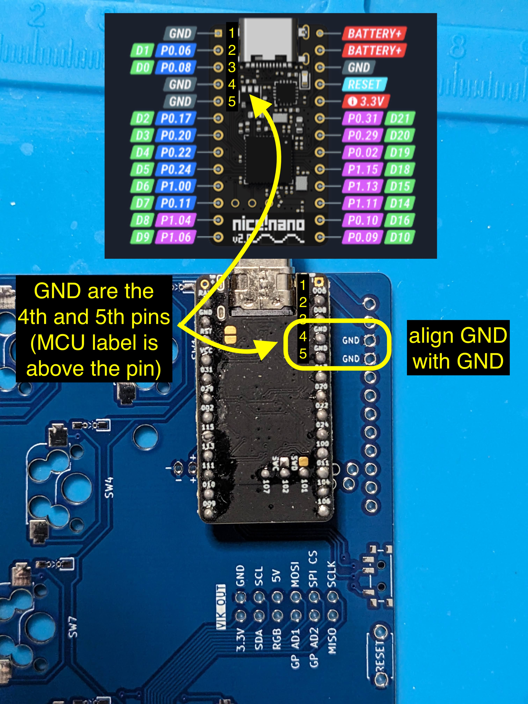
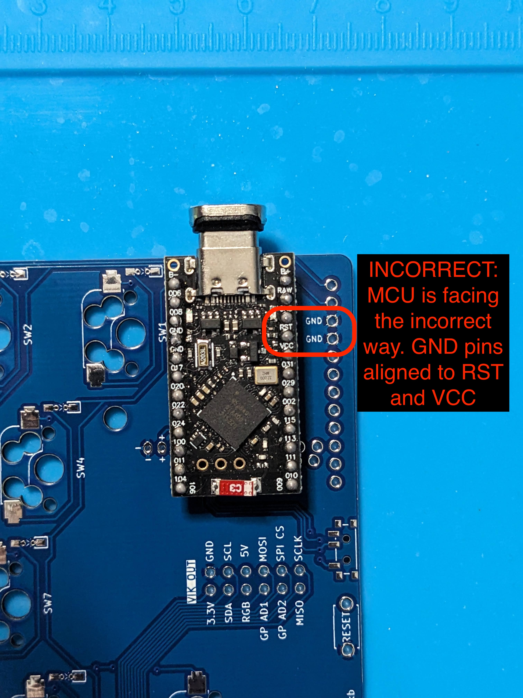
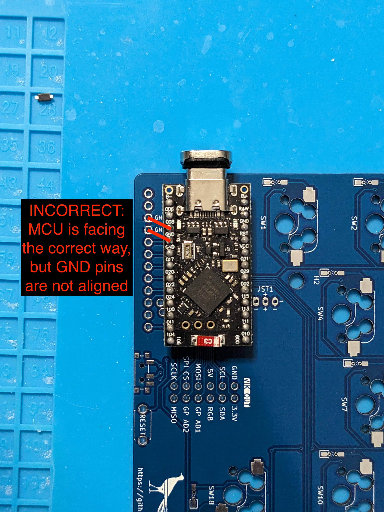

# Assembling the keyboard

## BOM

| Part                           | Quantity | Notes                                                                                                                           |
| ------------------------------ | -------- | ------------------------------------------------------------------------------------------------------------------------------- |
| built menura pcb               | 2        |                                                                                                                                 |
| menura bottom plate            | 2        | all layouts share one common bottom plate                                                                                       |
| menura top plate               | 2        | choose the top plate corresponding to your layout (e.g. 3x5_3, 3x5_2 or 23332_2)                                                |
| MX switches                    | 30-36    |                                                                                                                                 |
| MX keycaps                     | 30-36    |                                                                                                                                 |
| m2 screws                      | 16       | countersunk, 5mm works, other lengths are probably fine too                                                                     |
| m2 spacers                     | 8        | 8mm                                                                                                                             |
| rubber feet                    | 8+       | e.g. 3M bumpons, SKUF rubber feet, adhesive neoprene etc                                                                        |
| (optional) menura center wedge | 1        | choose a wedge corresponding to your desired distance and angle between halves when in unibody mode                             |
| (optional) magnets             | up to 20 | 8x2mm round [example](https://www.amazon.com/gp/product/B09BB1VT4J/), tune magnet count to match desired strength of connection |

## Assembly

This is where the menura shines!
With one built PCB, you have the flexibility to choose between multiple layouts at assembly time, ranging from a 3x5+3 to a 23332+2 hummingbird.

Case files are published in the repo, under [`case/stl`](https://github.com/rmuraglia/menura-kb/tree/main/case/stl), with step files or fusion project files one directory above, if you prefer that format, or want to make tweaks to the case.  
Choose one (or more) `top_*` files, and experiment with different layouts!

> [!WARNING]
> Before installing the PCB into a case, it is highly recommended to [flash a test firmware](#studio) and verify that everything is working as expected

1. Insert a few (4-ish) switches into the top plate. I usually use the switches in the corners.
2. Insert the switch pins from that assembly into the PCB's hotswap sockets
3. Ensure that all the switches look well aligned
4. Insert the rest of the switches into the plate and PCB
5. From the bottom, insert the spacers through the PCB's mounting holes
6. From the top, screw in a set of screws to hold the spacers in place
7. Align the bottom plate with the spacers, and screw in the second set of screws
8. If inserting magnets, press fit them into the holes
    1. double check the magnet orientation before insertion
    2. the hole's tolerance may be slightly off -- you may need to either scrape the hole with a blade to make more room, or use a dot of glue to hold the magnet in place
9. Stick on a set of rubber feet
10. Install keycaps

# Flashing firmware

## Studio

The firmware included with the [releases](https://github.com/rmuraglia/menura-kb/releases) support [ZMK studio](https://zmk.dev/docs/features/studio) for easy UI-based keymap configuration without requiring building or flashing new firmware to your keyboard.
If you are more familiar with QMK, ZMK studio is analogous to Vial for QMK.

The stock keymap looks like this:

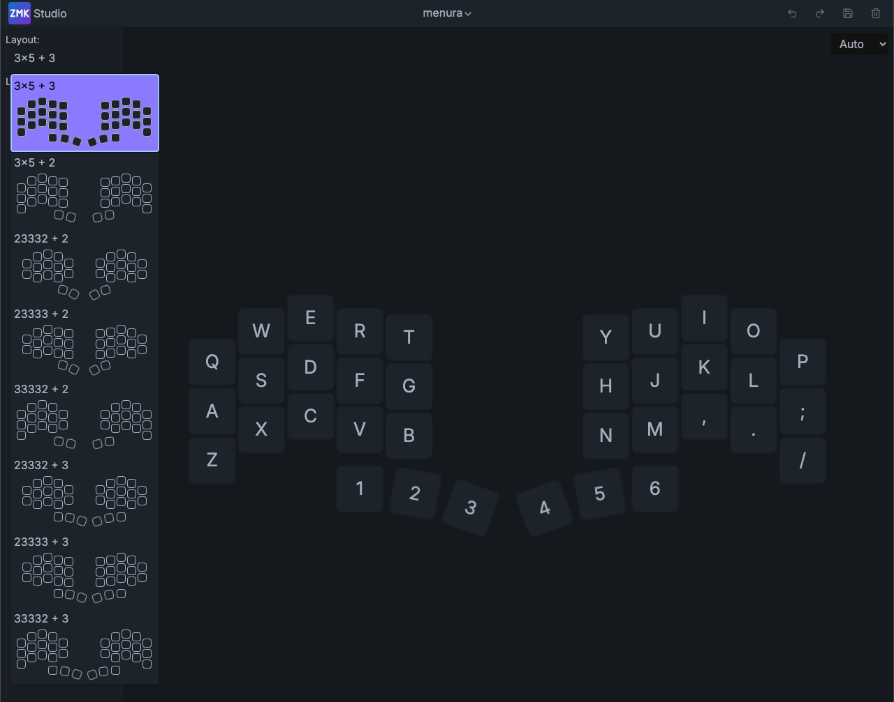

This keymap is only really intended for testing that all switch positions are functioning appropriately.  
When you are ready to customize your layout, the `&studio_unlock` binding is triggered by pressing four keys simultaneously:

- for layouts with 3 keys in the pinky columns, this will be the top two pinky keys on each side. Assuming the stock layout, this will be the Q, A, P and ; keys
- for layouts with 2 keys in the pinky columns, this will be all four pinky keys

Once you are in the studio UI, you can remap keys, add layers, and even change the layout.
The screenshot above shows the available layouts in the drop down menu.

Note that when you load up studio, the top pinky keys may appear blank or different -- this is because they are actually tap dances used for entering the bootloader if you want to flash custom firmware (see the ZMK config section below for more information).
Be cautious in remapping these keys if you plan on going that route down the line, and do not have easy access to your physical reset button.

## ZMK config

If you want to create your own ZMK config and define your keymap in code, the [menura shield definition](https://github.com/rmuraglia/zmk-keyboards-menura) is accessible as a [ZMK module](https://zmk.dev/docs/features/modules).  
This means you only need to add the menura module to your projects list in your `west.yml`, then the menura shield will be available to your builds.

For a tangible example, here's how my `zmk-config` uses the menura module:

- first I [add a new remote](https://github.com/rmuraglia/zmk-config/blob/8d228a5c4ef68459f12914036d7ad219430e42fd/config/west.yml#L15-L16) for the menura repo's github url base
- then I [add the menura project](https://github.com/rmuraglia/zmk-config/blob/8d228a5c4ef68459f12914036d7ad219430e42fd/config/west.yml#L35-L37). note that I use a non-main revision, but that's for testing something unrelated -- you should use the main branch
- then under [`zmk-config/config/`](https://github.com/rmuraglia/zmk-config/tree/8d228a5c4ef68459f12914036d7ad219430e42fd/config) I add my menura keymap and conf files
    - note that if you are using a layout other than the default 3x5+3, you may want to declare a [chosen node](https://github.com/rmuraglia/zmk-keyboards-menura/blob/main/boards/shields/menura/menura.dtsi#L146-L149) with the appropriate layout, like `&menura_23332_2_layout`.
- finally, I add the menura to my [github actions build list](https://github.com/rmuraglia/zmk-config/blob/8d228a5c4ef68459f12914036d7ad219430e42fd/build.yaml#L31-L34)

To enter the bootloader for flashing firmware, you can quickly double tap the reset button, but if that's inaccessible or inconvenient, the stock keymap from the previous section also provides a [tap dance](https://zmk.dev/docs/keymaps/behaviors/tap-dance) for entering the bootloader on each half: simply mash the top pinky key (Q or P, conventionally) three times within 250 ms.

