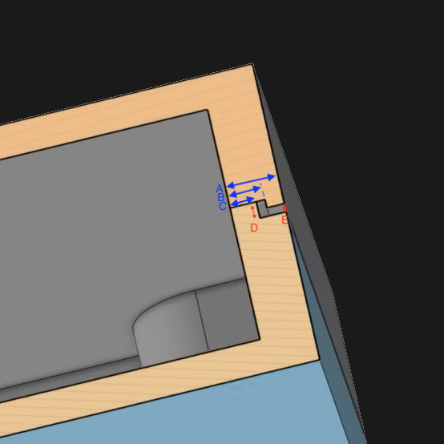

This is more of a personal archival note to document how I did this case design, and isn't really intended for external consumption, but you're welcome to browse it.

# General case shape

Overall, my starting point for building understanding on fusion 360 and case design were:

- [Sadek Baroudi's case design guide](https://github.com/sadekbaroudi/keyboard-guides/tree/master/cases)
- [Hazel's bad wings v1 original case](https://github.com/hazels-garage/bad-wings/tree/master/v1/cases/original), and the minor tinkering I did in that case
- The (unpublished, but shared privately) fusion design file for the [vulpes minora case](https://github.com/sadekbaroudi/vulpes-minora/tree/master/case).

My general approach was going to follow the same general case design composed of:

- a flat bottom plate
- a top switch plate, with offset walls to "reach down" to the plate, and hollowed out areas to provide clearance for top-of-pcb components like the MCU

## Measurements

Base measurements:

- PCB and plate thickness: 1.6mm
- hotswap socket: 1.8mm
- switch bottom to housing to top of clip point: 5mm (from [cherry switch diagram](https://www.cherry.de/en-gb/gaming/developer))
- PCB bottom to USB top: 10mm (on left side, where USB is taller -- this is the tallest component which will determine the overall height)

In general, this integrated plate design suggests that using the bottom of the switch plate as the vertical "origin" from which we will determine relative measurements makes sense.

Derived measurements:

- switch plate top to usb top: 3.4 (10 - 1.6 - 5)
- switch plate bottom to usb top: 5 (3.4 + 1.6)
- mcu hollowed out area: 5.4 (5 + 0.4 buffer) to 7 (+1.6 wall thickness)
    - important +7 is the max height
- switch plate top to bottom of sockets: 6.8 (5 - 1.6 (housing minus plate thickness) + 1.6 (pcb) + 1.8 (sockets))
    - note: Sadek's case guide suggests 8 mm as a safe height for MX hotswap

## Shadow line

This [hackaday article](https://hackaday.com/2023/08/07/enhance-your-enclosures-with-a-shadow-line/) gives a good overview of shadow lines.

I rotated and annotated it, to suit my desire to have the top create the gap with an overhang, rather than the bottom reaching up.

# Fusion operations

## Extrudes

1. Bottom going up:
    1. main pcb area: 1.6 baseline thickness
    2. inner ring: 1.6 base + 0.4 gap + 0.8 step = 2.8
    3. middle and outer ring: 1.6 baseline thickness
2. Top going down (from switch plate bottom):
    1. inner + middle wall: 6.8 (meet the 1.2 extra height of the inner ring from the bottom to make a flush 8mm gap)
    2. outer ring: 7.6 (6.8 + 0.8 step, leave a 0.4mm shadow line gap)
3. Top going up (from switch plate bottom):
    1. switch plate and thumb cutout: 1.6 baseline thickness
    2. solid max height area (e.g. connecting walls to hollow areas, areas between switches and outer edge of case): 7mm (previously determined max height)
    2. mcu hollowed out area: 5.4 - 7

# Magnet holes

# Center wedge