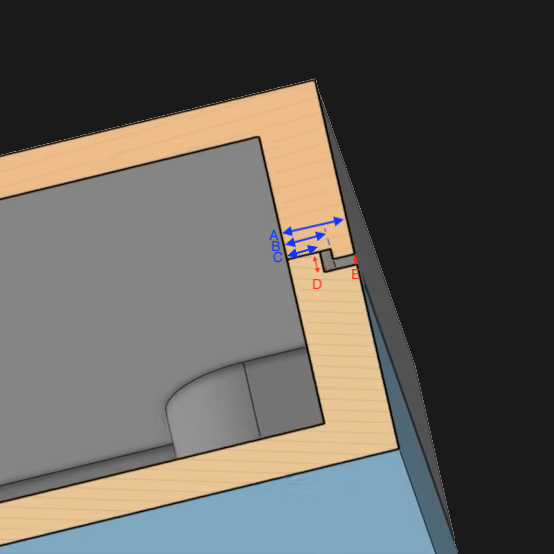

This is more of a personal archival note to document how I did this case design, and isn't really intended for external consumption, but you're welcome to browse it.

# General case shape

Overall, my starting point for building understanding on fusion 360 and case design were:

- [Sadek Baroudi's case design guide](https://github.com/sadekbaroudi/keyboard-guides/tree/master/cases)
- [Hazel's bad wings v1 original case](https://github.com/hazels-garage/bad-wings/tree/master/v1/cases/original), and the minor tinkering I did in that case
- The (unpublished, but shared privately) fusion design file for the [vulpes minora case](https://github.com/sadekbaroudi/vulpes-minora/tree/master/case).

My general approach was going to follow the same general case design composed of:

- a flat bottom plate
- a top switch plate, with offset walls to "reach down" to the plate, and hollowed out areas to provide clearance for top-of-pcb components like the MCU

## Measurements

Base measurements:

- PCB and plate thickness: 1.6mm
- hotswap socket thickness: 1.8mm
- switch bottom to housing to top of clip point: 5mm (from [cherry switch diagram](https://www.cherry.de/en-gb/gaming/developer))
- PCB bottom to USB top: 10mm (on left side, where USB is taller -- this is the tallest component which will determine the overall height)

In general, this integrated plate design suggests that using the bottom of the switch plate as the vertical "origin" from which we will determine relative measurements makes sense.

Derived measurements:

- switch plate top to usb top: 3.4 (10 - 1.6 - 5)
- switch plate bottom to usb top: 5 (3.4 + 1.6)
- mcu hollowed out area: 5.4 (5 + 0.4 buffer) to 7 (+1.6 wall thickness)
    - important: +7 is the max height
    - note that the 0.4 buffer sounds small, but really the height of the usb port (with magnetic tip) is much more than the mcu board itself, so this should be plenty
- switch plate top to bottom of sockets: 6.8 (5 - 1.6 (housing minus plate thickness) + 1.6 (pcb) + 1.8 (sockets))
    - note: Sadek's case guide suggests 8 mm as a safe height for MX hotswap

## Shadow line

This [hackaday article](https://hackaday.com/2023/08/07/enhance-your-enclosures-with-a-shadow-line/) gives a good overview of shadow lines, but the concept is that you use mating pieces, such that on the inside, the parts are flush, but on the outside there is a small gap -- this gap, backed by the flush pieces gives a better appearance of uniformity at the seam, compared to just attempting to get the outermost walls flush with each other.

I rotated and annotated it, to suit my desire to have the top create the gap with an overhang, rather than the bottom reaching up.  
For ease of FDM printing, I was advised to choose measurements in multiples of the nozzle and layer height, so 0.4mm was selected. Some discussion in discord on the topic: [link](https://discord.com/channels/989552667330228374/1104037399517986947/1306638628612739103).

The measurements I ended up choosing were as follows:

- total wall thickness (A): 3mm
- inner wall thickness (C): 1.2mm
- horizontal gap: 0.6 (3 - 1.2 - 1.2 for even wall thicknesses)
    - implies B (outer wall offset) is 1.8 (1.2 + 0.6)
- vertical gap (E): 0.4
- vertical mating notch (D): 1.2 (0.4 gap + 0.8 step)

To minimize repeated manual work in fusion (offsetting curves in sketches), I added outlines for these additional wall thicknesses to my ergogen config (see `(board|shadow)_(inner|outer)_wall`).  
These outlines are all generated with no fillet, to help fusion import gapless DXFs that require minimal fixing.  
Note that this lack of filleting in the ergogen stage will come back to bite us in the [cosmetics](#cosmetics) section, so be sure to check that out.

# Fusion

With all of those measurements in place, we can do the basic extrudes in fusion that give the case its general shape:

## Sketch modifications

Before extruding, I did do some minor sketch modifications to make the extruding easier:

1. I sectioned off the hollow areas, so it can be treated as a different face for extrusion. This generally means extending some lines:
    1. bottom pinky bottom edge to the left wall
    2. tucky thumb tucky edge to bottom wall
    3. reachy thumb reachy edge to bottom wall
    4. vik top and bottom edges to right wall
2. I also cleaned up some leftover, internal lines that did not meaningfully contribute to the outline:
    1. bottom of power switch
    2. bottom left mounting hole
    3. vik and jst overlap
3. Last to provide a wall to connect the raised, hollow areas with switchplate-height part of the case, I added some offsets around the mcu and vik connector.

## Extrudes

1. Bottom going up:
    1. main pcb area: 1.6 baseline thickness
    2. inner ring: 1.6 base + 0.4 gap + 0.8 step = 2.8
    3. middle and outer ring: 1.6 baseline thickness
2. Top going down (from switch plate bottom):
    1. inner + middle wall: 6.8 (meet the 1.2 extra height of the inner ring from the bottom to make a flush 8mm height)
    2. outer ring: 7.6 (6.8 + 0.8 step, leave a 0.4mm shadow line gap)
3. Top going up (from switch plate bottom):
    1. switch plate and thumb cutout: 1.6 baseline thickness
    2. solid max height area (e.g. connecting walls to hollow areas, areas between switches and outer edge of case): 7mm (previously determined max height)
    2. mcu hollowed out area: 5.4 - 7

At this point, I also add the m2 countersunk holes at all the mounting points. 
Note that the outer diameter of the countersunk screw head clearance is 4.4mm.

## Component cutouts

Next we need to add cutouts or windows for all the components.
Luckily, the ergogen config already has these rendered in the sketch, so all we have to do is *project* a relevant line from that sketch onto the desired plane, then draw around that as a reference.

### USB port

1. Project a line from the MCU outline to know where the cutout should be centered
2. We know that the top of the USB port *should* be 1.6 to 2 mm from the top of the case (based on the case thickness + 0.4 buffer we allowed)
3. So we start the cutout at **1.2mm from the top** of the case to give a bit more breathing room
4. Then we know we want the cutout to be **8mm tall**, just from other designs -- this gives room for the chunky magnetic tip, and gives some vertical allowance for the flipped MCU on the right/left sides which influences the USB port mounting
5. Then we see the projected line is *18mm* long, and we want our cutout to be centered along that. We want the cutout to be **12mm wide** (again from other designs), so we start the cutout **3mm offset from the end** of the projected line

### Power switch

1. The power switch sits on top of the PCB, so we first make a reference line 10.4mm from the top of the case for the top of the PCB: 7 from top of case to switchplate bottom + 5 for switchplate top to pcb top - 1.6 for switchplate thickness
2. The projected line is 8.8mm wide, and we want our power switch cutout slot to be constructed as a center-to-center slot, with a 4mm wide distance between centers, so we measure a horizontal offset of 2.4mm
3. The slot is vertically centered 0.75mm above the top of the PCB (I honestly don't remember why, this is probably the half the thickness of the power switch)
4. Finally, we create the slot based on those centers, with a slot height of 3mm, giving us two 1.5mm radius semi circles on the ends.

For the power switch, we additionally create a second cutout in the wall to create a channel for the protruding switch to go through during PCB insertion to the case.  
In this case, the actual toggle switch is small, so we just arbitrarily cutout the width of the rectangular portion of the slot up to the midpoint of the wall thickness.
For chunkier toggles, you may want to be more precise here.

### Reset button

1. For this, we are actually making a cutout in the plane of the component's sketch, so it is really simple
2. The only change is that instead of using the full footprint's width (9mm), we just make the cutout 6mm wide, which is the width of the button itself, so we offset horizontally by 1.5mm on one side.

### Vik cable

1. The vik cable will be roughly aligned with the top of the PCB, so the cutout will be centered **10.4mm from the top** of the case. (7 from top of case to switchplate bottom + 5 for switchplate top to pcb top - 1.6 for switchplate thickness)
2. The FFC cable slit will be **7mm wide and 1mm tall**
3. The reference projected line from the footprint is 11mm long, so we offset by 2mm on the side

## Magnet holes

For the magnet holes, I received a few tips, based on [this model](https://github.com/VoronDesign/Voron-Tap/blob/29e900094a0f094aad88493c76ec5a6d39f94812/STLs/Tap_Center_left_r8.stl) and this discord [conversation](https://discord.com/channels/939959680611020840/1054306614158557214/1308157606388437072):

1. For circular magnets, instead of attempting to fit it exactly to a circular hole, use a slightly undersized circumscribed hexagonal hole instead. This will give you a good combination of flex and relief, giving you the best fit possible with some printing tolerance
    - For 8mm magnets, I found a 7.95mm diameter hole to work well (any bigger was too loose)
    - For 5mm magnets, I found a 4.95 diameter hole to have mixed success.
        - In the wedge piece, it worked great, but in the case piece it was too tight. This may be due to different body rigidities and different amounts of Z-axis squishing during printing.
2. Add a small undercut at the bottom of the hole to deal with printing artifacts in inside corners.
    - note that in practice, I did not find this tip to be necessary for my magnets (probably because they are thinner than the advertised thickness, so they didn't need to be seated totally flush in the hole)

Separately, [this video](https://youtu.be/Bd7Yyn61XWQ) had some good tips on printing holes, the main one that I used was adding a chamfer to the hole to help guide a part for insertion.
I used a **0.4mm chamfer**, which seemed to work well.

And lastly, in addition to relief via the hex shape, I added a 1.5mm tall slot running across the magnets to serve as both extra relief, and also as a channel where I could insert tweezers to pry out misplaced magnets (e.g. in the wrong orientation).

Specific to my case, I chose [8x2mm magnets](https://www.amazon.com/gp/product/B09BB1VT4J/), as I thought those would conveniently embed into my 3mm thick case wall.  
I wanted to ensure that the magnet was mostly embedded in a portion of the wall that was 3mm thick, and not a portion that was thinner due to the shadow line overhangs.  
This meant that I set the magnet midpoint to be **6.9mm from the top of the case**, from (7 (upwards extrude) + 6.8 (inner + middle wall downwards extrude))/2.

Finally, again, specific to my case, I spaced the magnets out as shown below (unscientifically):
For the longer edge, I put one magnet in the center, then offset centers by 13mm for even spacing:

For the shorter edge, the magnets are a set a bit more arbitrarily to work around the vik slot:

## Cosmetics

### Fillets

Recall that the outline of the PCB is filleted with a value of 5 in ergogen, but the exported outlines for the case are not.
You will want to recreate this fillet.  
For outer corners, and corners part of the outer shadow line wall, use the same 5mm value.  
For corners part of the inner shadow line wall (where the PCB would actually contact the case), use a smaller 2mm value.

In theory, I feel like 5mm should be fine for all of these, but in practice, 5mm on the inner walls added too much material and made the PCB rub against the case.

### Chamfers

I used chamfers to just make the edges of the case less severe.
Some values for reference (unscientifically chosen):

- 1.5mm along the top edge of the case
- 0.4mm around the reset button cutout
- 0.5mm around the power switch cutout
- 1mm around the usb port cutout

# Center wedge

To create the center wedge, there are two main levers that are captured in the file name:

1. the angle between a piece and the vertical
2. the distance between the top of halves

This seems like it would be well suited to [parametric modeling](https://help.autodesk.com/view/fusion360/ENU/?guid=GUID-76272551-3275-46C4-AE4D-10D58B408C20) but in practice, I wouldn't get this to scale/regenerate assets well.

In general my procedure was:

1. Import a basic sketch of the case outline (e.g. the bottom plate should be sufficient, as long as it accounts for the added wall thickness)
2. Rotate the outline by the desired split angle (e.g. for ffkb or bad wings, this is 15 degrees from the vertical, so the halves are 30 degrees from each other)
3. Draw a vertical line that's horizontally offset to half of the desired spacing (use a sketch dimension)
4. Move/copy the outline as a rotation about that line to create a mirrored copy of the outline
5. Connect lines across the mirrored copy and original to create a closed face in the middle.
6. If necessary, draw features in that center face (e.g. display or trackpad slot)
7. Extrude the face to a total height of 16.6mm (1.6 bottom plate thickness + 8mm to switch plate bottom + 7 switch plate bottom to top)
8. Create magnet cutouts to match those in the case (magnet center is 6.9mm from top)
9. If necessary, create vik slot aligned to that from the case, hollow out body to make room for accessory PCB and components
10. Chamfer the top edge to match the case (1.5mm)

Note to future self: the first wedge I made (15 deg, 18mm) was actually defined by a 4mm distance on the bottom of the wedge, so the 18mm is not quite right (it is more like 18.5).
